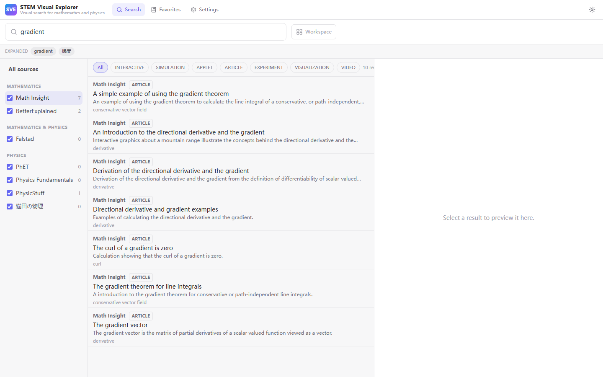
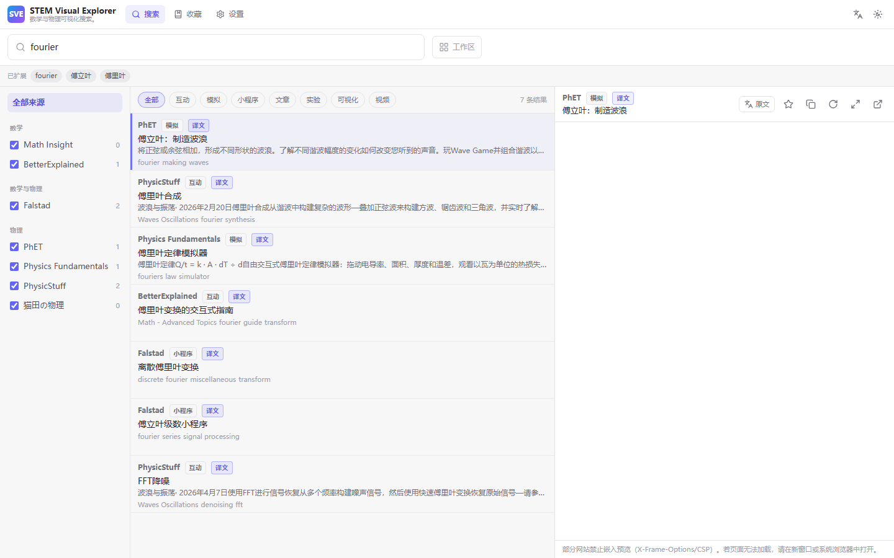

<div align="center">


# STEM Visual Explorer

**Visual search and comparison for mathematics and physics resources.**

**Status:** 🟡 Beta

[Web App](https://styayur.github.io/stem-visual-explorer/) · [Windows](https://github.com/styayur/stem-visual-explorer/releases/latest) · [Documentation](docs/architecture.md) · [Releases](https://github.com/styayur/stem-visual-explorer/releases) · [Discussions](https://github.com/styayur/stem-visual-explorer/discussions)

[English](README.md) · [中文](README.zh-CN.md)

[](https://github.com/styayur/stem-visual-explorer/releases/latest)
[](https://github.com/styayur/stem-visual-explorer/actions/workflows/ci.yml)
[](LICENSE)
[]()
[]()
[]()



</div>

## Live web version

A fully static build runs in the browser — no server, no API keys:

**https://styayur.github.io/stem-visual-explorer/**

The desktop app queries the sites live through Rust. The web version instead
ships a pre-generated snapshot of every provider's index
(`public/index/*.json`, ~1075 entries) and runs the same deterministic query
parser, synonym expander and ranking algorithm in the browser, so search is
instant. Previously loaded indexes and their manifest are cached locally and can
be searched without index-server access. Loading the app itself offline still
depends on the browser's asset cache; this is not an installable offline PWA.


*The same app in 简体中文 with result translation enabled:*



---

## Capability-aware previews and concept search

Providers declare `Embed`, `NativeCard` or `ExternalOnly` in the shared
`src/lib/previewCapabilities.json`. Only Falstad currently opts into embedding;
Math Insight, PhET, BetterExplained, Physics Fundamentals and PhysicStuff use
native resource cards, and Maotian uses external-only access. Unknown or
mismatched origins default to cards. These are conservative product policies,
not claims that every listed site blocks frames. Cards include resource metadata
and dictionary-derived related/prerequisite concepts, with explicit missing-data
labels and independent viewer / browser actions. Preview, Quick Look and Workspace
share the policy. No proxy strips CSP/X-Frame-Options; translation proxies are
never used as an embedding fallback. A manual card fallback handles newly blocked
Embed sources that cross-origin browser APIs cannot reliably detect.

Windows WebViewers provide Back, Forward, Reload, Copy URL, Open External,
Always on Top and Close. Results and workspace panes can open multiple viewers.
Popup windows use the same validated HTTP/HTTPS path. Viewer labels are denied
application commands even after navigating to a local app URL. Workspace metadata
is preserved while legacy URL-only payloads remain supported.

`src/lib/concepts.json` is the single offline dictionary/graph used by TypeScript
and Rust: stable concept IDs, English/Simplified/Traditional labels, synonyms,
aliases, related concepts and prerequisites. Longest-term matching resolves
multiword concepts in either language. Variants have weights original **1.0**,
canonical **0.95**, synonym **0.9**, alternate **0.75**, related **0.35**. Expansion
is deduplicated by concept and text; related edges are followed only once and
prerequisites are explanatory metadata. Exact quoted phrases and source/type
filters retain their semantics. Ranking uses weighted, capped field matches and
stable tie-breakers, without any LLM or network normalization dependency.

## Features

- **Unified mixed search** — all enabled sources are queried concurrently in Rust,
  then merged into one deterministically ranked stream.
- **Source adapters, not hard-coded UI** — every website is an independent Rust
  `SearchProvider`. The frontend never contains per-site logic.
- **Two indexing strategies** — native site search where it exists
  (BetterExplained), and a cached static directory index everywhere else
  (Math Insight, Falstad, PhET, Physics Fundamentals, PhysicStuff, 猫田の物理).
- **Deterministic relevance scoring** — exact title match, token matches, tag
  matches and a small interactive bonus. No ML, no black box.
- **Built-in translation** — UI in English / 简体中文 / 繁體中文, machine
  translation of result titles & descriptions into 20+ languages (keyless
  MyMemory API + offline STEM glossary), and native-page translation
  (in-place in the desktop app).
- **Bilingual query normalizer** — a local Chinese ↔ English synonym dictionary
  (`梯度 → gradient`, `旋度 → curl`, `驻波 → standing wave`, …). A query like
  `旋度 curl` expands both ways.
- **Small query syntax** — `site:falstad wave`, `source:phet gradient`,
  `type:interactive gradient`, `"standing wave"`.
- **Preview modes** — `Side` (right pane), `Inline` (bottom pane) and `Off`.
- **Real multi-window** — double-click (or `Ctrl/Cmd+Enter`) opens an independent
  WebView window with its own Back / Forward / Reload / Copy URL / Open externally /
  Pin / Close toolbar.
- **Workspace mode** — select up to four results and open them in a 1/2/3/4-pane
  grid, plus a notes pane.
- **Quick Look** — press `Space` for a full-window overlay of the selected result.
- **Favorites & history** — stored locally in SQLite on desktop and localStorage
  in the browser. Settings includes history replay and clearing; repeated queries
  are deduplicated and history is limited to 200 entries.
- **Dark / light / system theme** — dark mode tuned for low-contrast, deep-grey
  surfaces.
- **Keyboard first** — the whole app is usable without a mouse.

---

## Supported sources

| Source | Homepage | Adapter strategy | Result types |
| --- | --- | --- | --- |
| Math Insight | <https://mathinsight.org/> | Static directory index (`/page/list`, `/applet/list`, `/video/list`) enriched with titles/descriptions from `/index/general` | article, applet, video |
| Falstad | <https://falstad.com/mathphysics.html> | Static applet directory index, grouped by section | applet |
| PhET Interactive Simulations | <https://phet.colorado.edu/> | Full simulation metadata JSON (title, description, thumbnail, page URL) | simulation |
| BetterExplained | <https://betterexplained.com/> | Live WordPress search (`?s=…`) **plus** a cached archive index parsed from `/articles/` | article, interactive |
| Physics Fundamentals | <https://physicsfundamentalsinfo.com/labs/> | Static labs directory index | simulation |
| PhysicStuff | <https://physicstuff.com/lab> | Static lab directory index | interactive |
| 猫田の物理 | <https://maotian.nomaki.jp/> | Static homepage index (chapter + sub-visualization anchors) | visualization |

PhysicStuff and 猫田の物理 are marked **experimental**: their markup is simplified
and may need parser updates if the sites change.

> **Note on Math Insight native search.** Math Insight *does* expose a search page
> (`/search/?q=…`), but at the time of writing its server-side index returns
> "No results found" for every query. The adapter therefore falls back to the
> static directory index, which is complete and reliable. If Math Insight restores
> its search backend, the native path can be re-enabled without touching the UI.

---

## Translation

### The app's own content

- **Interface languages:** English, 简体中文, 繁體中文 — switch from the globe
  menu in the header or *Settings → Language & translation*. English is the
  per-key fallback, so adding a locale only needs one dictionary
  (`src/lib/i18n/dict.ts`).
- **Search results:** enable *Translate result titles & descriptions* to
  machine-translate English results into the selected target language (20+
  options: 简体中文, 繁體中文, English, 日本語, 한국어, Español, Français, Deutsch,
  Русский, Português, Italiano, العربية, हिन्दी, ไทย, Tiếng Việt, Bahasa
  Indonesia, Türkçe, Nederlands, Polski, Українська …).
- **Pipeline:** in-memory + `localStorage` cache → offline STEM glossary
  (~70 terms, instant, no network) → **MyMemory** machine translation
  (free, keyless, CORS-enabled). Requests are queued (3 concurrent, rate
  limited) so bulk translation stays inside the free quota. A translated row
  shows a small “译文 / Translated” badge and keeps the original as a tooltip.

### Native web pages

| Where | How it works |
| --- | --- |
| **Desktop app** | External windows get an in-place **A/文** button in the floating toolbar. It walks the page's text nodes, translates them with MyMemory, and swaps the text directly in the DOM; press it again to restore the original. This is a *real* full-page translation of the native site. |
| **Web version** | Browsers forbid a page from scripting a cross-origin iframe, so the preview cannot rewrite the embedded site's DOM. The preview's **Original / Translated** toggle therefore shows the translated title + summary and offers **Open translated page**; if you configure a **custom page-translation proxy** (settings → *Custom page-translation proxy*, using `{url}` / `{lang}`), the proxy URL is opened externally, never used to bypass an embedding policy. |

Translation requires network access to the third-party MyMemory service. It is
off by default, and the app is fully usable without it (the offline glossary
still glosses STEM terms).
## Architecture

```
stem-visual-explorer/
├─ src/                     React + TypeScript + Vite frontend
│  ├─ components/           SearchBar, SourceSidebar, SearchResults, PreviewPane,
│  │                        QuickLook, FilterBar, Workspace, …
│  ├─ stores/               Zustand stores (search, settings, workspace)
│  ├─ lib/                  typed Tauri command wrappers, shortcuts, types
│  └─ pages/                SearchPage, FavoritesPage, SettingsPage
└─ src-tauri/               Rust backend
   ├─ src/providers/        one module per website + shared index helpers
   ├─ src/search/           query parser, synonym normalizer, ranking, manager
   ├─ src/cache/            JSON index cache (versioned, 7-day TTL)
   ├─ src/database/         SQLite favorites + history
   ├─ src/windows/          multi-window browser + injected toolbar
   ├─ src/commands.rs       Tauri command surface
   └─ tests/fixtures/       HTML/JSON fixtures for parser unit tests
```

### Data flow

```
SearchBar → Query Parser → Query Normalizer → Provider Manager
          → concurrent provider search (tokio + per-provider timeout)
          → unified SearchResult → deterministic scoring → merge + sort → UI
```

Each provider runs in its own task with a 15 s timeout. **A failing provider never
fails the whole search** — its status is returned as `error` and every other
provider's results are still shown.

---

## Product boundary and provider contract

**The core domain is STEM resource discovery, comparison, and learning context, not a general-purpose browser.** See [docs/architecture.md](docs/architecture.md) for the full boundary contract. WebViewer supports inspection of the selected resource; it does not become a tabbed browser or bypass CSP/X-Frame-Options through a proxy. New providers must follow [the provider extension contract](docs/provider-extension.md) and pass metadata, host-policy, PreviewCapability, and parser-fixture contract tests.

## Provider architecture

The central abstraction is:

```rust
#[async_trait]
pub trait SearchProvider: Send + Sync {
    fn id(&self) -> &'static str;
    fn name(&self) -> &'static str;
    fn homepage(&self) -> &'static str;
    fn experimental(&self) -> bool { false }
    fn indexed_items(&self) -> Option<usize> { None }
    fn last_updated(&self) -> Option<String> { None }
    async fn search(&self, ctx: &SearchContext, query: &NormalizedQuery,
                    opts: &SearchOptions) -> Result<Vec<SearchResult>>;
}
```

Every source is converted into the same struct:

```rust
pub struct SearchResult {
    pub id: String,
    pub source_id: String,
    pub source_name: String,
    pub title: String,
    pub description: Option<String>,
    pub url: String,
    pub result_type: ResultType, // article | interactive | simulation | applet
                                 // | experiment | visualization | video | unknown
    pub tags: Vec<String>,
    pub score: f32,
    pub thumbnail: Option<String>,
}
```

Providers are registered in one place — `ProviderRegistry::new()` in
`src-tauri/src/providers/mod.rs`:

```rust
ProviderRegistry::new()
    .register(Arc::new(MathInsightProvider::new()))
    .register(Arc::new(FalstadProvider::new()))
    .register(Arc::new(PhetProvider::new()))
    // …
```

There is no `if source == "falstad"` anywhere in the codebase.

### Adding a new website

1. Create `src-tauri/src/providers/example.rs`:

   ```rust
   use super::common::{self, CachedIndex, IndexEntry};
   use super::{SearchContext, SearchOptions, SearchProvider};
   use crate::error::Result;
   use crate::models::{NormalizedQuery, ResultType, SearchResult};
   use async_trait::async_trait;
   use std::sync::Mutex;

   pub struct ExampleProvider {
       index: Mutex<Option<CachedIndex>>,
   }

   impl ExampleProvider {
       pub fn new() -> Self { Self { index: Mutex::new(None) } }

       async fn fetch(ctx: &SearchContext) -> Result<CachedIndex> {
           let body = ctx.client.get("https://example.com/index").send().await?.text().await?;
           // Parse `body` (scraper) into Vec<IndexEntry> with absolute URLs.
           let entries: Vec<IndexEntry> = parse_index(&body)?;
           Ok(CachedIndex::new(common::dedupe(entries)))
       }
   }

   #[async_trait]
   impl SearchProvider for ExampleProvider {
       fn id(&self) -> &'static str { "example" }
       fn name(&self) -> &'static str { "Example" }
       fn homepage(&self) -> &'static str { "https://example.com/" }

       async fn search(&self, ctx: &SearchContext, query: &NormalizedQuery,
                       opts: &SearchOptions) -> Result<Vec<SearchResult>> {
           let need = { /* stale or opts.force_refresh */ true };
           if need {
               if let Ok(fresh) = Self::fetch(ctx).await {
                   *self.index.lock().unwrap() = Some(fresh);
               }
           }
           let entries = self.index.lock().unwrap();
           Ok(common::search_entries(self.id(), self.name(),
               entries.as_ref().map(|c| c.entries.as_slice()).unwrap_or(&[]), query))
       }
   }
   ```

2. Register it in `src-tauri/src/providers/mod.rs`:

   ```rust
   pub mod example;
   pub use example::ExampleProvider;
   // and inside ProviderRegistry::new():
   .register(Arc::new(ExampleProvider::new()))
   ```

3. Add a `#[cfg(test)]` parser test with an HTML fixture in
   `src-tauri/tests/fixtures/`.

That's it — the sidebar, filters, results, preview and windows all pick up the new
source automatically. **No frontend changes are required.**

---

## Installation

### Use it in a browser

**https://styayur.github.io/stem-visual-explorer/** — nothing to install.

### Prebuilt binaries

Download the latest `stem-visual-explorer.exe` (Windows) from the
[Releases](https://github.com/styayur/stem-visual-explorer/releases) page and run it.
Windows needs the WebView2 runtime, which ships with Windows 10/11.

### Build from source

Prerequisites:

- [Rust](https://rustup.rs/) (stable, 1.77+)
- [Node.js](https://nodejs.org/) 22.12+ and npm
- On Windows: the MSVC build tools **or** a MinGW-w64 toolchain with the
  `x86_64-pc-windows-gnu` Rust target
- Tauri system dependencies for your platform
  (<https://tauri.app/start/prerequisites/>)

```bash
git clone https://github.com/styayur/stem-visual-explorer.git
cd stem-visual-explorer
npm install
npm run tauri build          # or: npm run tauri dev
```

The compiled binary is written to
`src-tauri/target/release/stem-visual-explorer(.exe)`.

> **Windows GNU toolchain note.** If you build with
> `x86_64-pc-windows-gnu`, this repository already configures the self-contained
> `rust-lld` linker in `src-tauri/.cargo/config.toml`. Keep the
> `…/rustlib/x86_64-pc-windows-gnu/bin` directory (which contains
> `libgcc_s_seh-1.dll` and `libwinpthread-1.dll`) on your `PATH` so build scripts
> can run. The full desktop build additionally requires MinGW's `windres` and
> its preprocessing toolchain on `PATH`; the self-contained linker alone is
> sufficient only for the pure Rust logic checks.

---

## Development

```bash
npm install
npm run tauri dev      # hot-reloading desktop app
npm run build          # type-check + production frontend build (for Tauri)
npm run build:web      # static web build for GitHub Pages (base = /stem-visual-explorer/)
npm run preview -- --mode web   # serve the web build at http://localhost:4173/stem-visual-explorer/
```

### Static index (web dataset)

The web build reads `public/index/*.json` — a snapshot of every provider's local
index — so the browser never has to call the upstream sites (which would be
blocked by CORS). Regenerate it with:

```bash
cd src-tauri
cargo run --no-default-features --example dump_web_index   # writes ../public/index
```

Commit the regenerated JSON to refresh the published site. The browser caches the
indexes in `localStorage` and re-validates them whenever `updated_at` changes.

### Web smoke test

The deterministic regression suite starts its own Vite server and exercises
search, filters, favorites, history, settings, previews, keyboard shortcuts,
workspaces, translation, cache recovery and error handling:

```bash
npx playwright install chromium
npm run test:web
npm run test:web:build   # also checks the production Pages subpath
```

External frames and translation responses are fixtures in these tests. They
check application behavior independently of third-party availability. Screenshots
are saved under `dist-release/audit-desktop.png` and `audit-mobile.png`.
Set `SVE_CHROMIUM` to an existing Chromium executable if using a managed runtime.

`npm run test:desktop` exercises actual Windows WebView2 windows and Rust IPC.
It requires an isolated audit build and refuses to run against a normal user
profile. See [the functional audit](docs/functional-audit.md) for setup, verified
coverage and remaining external-service limitations.

The older optional live-service smoke test remains available:

```bash
python scripts/web_smoke_test.py   # via the webapp-testing with_server helper
```

It drives the real UI headlessly: searches `curl` / `旋度` / `standing wave`,
checks `site:` filtering and the sidebar source filter, verifies Chinese synonym
expansion, switches the interface to 简体中文, enables result translation and
asserts that Chinese translations appear, then refreshes `docs/screenshot.png`
and `docs/screenshot-zh.png`.

### Logic unit tests

```bash
npm test                                                    # offline (36 checks)
node --experimental-strip-types scripts/unit_test.mjs --live  # + one real MyMemory call
```

Covers the offline glossary, the query parser, synonym expansion,
matching/ranking and the translation URL helpers. Runs directly on Node's
TypeScript type stripping — no test framework required.

### Deployment

`.github/workflows/deploy-pages.yml` builds the site with `npm run build:web` and
publishes it with GitHub Pages (Actions source). Every push to `main` redeploys.

Rust checks:

```bash
cd src-tauri
cargo fmt --check
cargo clippy --no-default-features --all-targets   # lint the pure logic + tests
cargo clippy                                       # lint the Tauri-facing code
cargo test --no-default-features                   # parser/query/ranking unit tests
```

`--no-default-features` disables the `tauri` feature so the test suite links only
the pure logic (no GUI/webview runtime needed). The 34 tests cover every provider
parser, query normalization/ranking, URL validation, database persistence, cache
recovery and provider failure isolation. CI also checks desktop compilation on Windows.

To verify the **live** providers against the real websites (network required):

```bash
cd src-tauri
cargo run --no-default-features --example probe
```

`examples/probe.rs` runs every acceptance query (`gradient`, `curl`,
`divergence`, `standing wave`, `harmonic oscillator`,
`electromagnetic induction`, `quantum`, `Fourier`, `梯度`, `旋度`, `驻波`)
through the real concurrent search pipeline and prints per-source result counts,
so you can confirm that the adapters still parse correctly.

### Running in a browser

When the frontend runs outside Tauri (`npm run dev`, or the deployed GitHub Pages
site) it transparently switches to the **static-index backend**: search runs
entirely client-side against the pre-generated JSON indexes, favorites/history/
settings use `localStorage`, and “open in new window” becomes a normal browser tab.
The desktop app keeps using the live Rust backend. Either way the search logic is
the same deterministic algorithm — there is no mock or fabricated data.

---

## Search syntax

| Input | Meaning |
| --- | --- |
| `gradient` | search every enabled source |
| `site:falstad wave` | only Falstad |
| `source:phet wave` | only PhET |
| `type:interactive gradient` | only interactive results |
| `"standing wave"` | exact phrase |
| `旋度` | expands to `curl` (and vice versa) |

## Keyboard shortcuts

| Keys | Action |
| --- | --- |
| `Ctrl/Cmd + K` / `Ctrl/Cmd + L` | focus the search box |
| `Enter` | open the selected result in a new window |
| `Ctrl/Cmd + Enter` | open the selected result in a new window |
| `Space` | Quick Look |
| `Ctrl/Cmd + D` | favorite the selected result |
| `Ctrl/Cmd + W` | close Quick Look |
| `Esc` | close Quick Look |
| `↑` / `↓` | move the selection |
| Right-click a row | Open / New Window / System Browser / Copy URL / Favorite |

In a standalone browser window the injected toolbar adds Back, Forward, Reload,
Copy URL, Open externally, Pin and Close.

---

## Privacy

STEM Visual Explorer is a **local-first** tool:

- No account, no login, no telemetry, no analytics.
- No cloud database; favorites, history, settings and cached indexes live only on
  your machine (app data directory, plus a small SQLite file).
- Network requests go **directly** from your machine to the source websites — there
  is no proxy or middle server.
- No AI/LLM ranking: relevance scores are computed from a fixed, transparent formula.
- Translation is **off by default**. When you enable it, only the text you are
  translating (a result title/description, or a page's text nodes in the desktop
  app) is sent to the third-party **MyMemory** translation API. Terms already in
  the offline glossary are translated locally and never leave your machine.

The app is a polite HTTP client: it sends a descriptive `User-Agent`
(`STEMVisualExplorer/<version>`), uses a small number of concurrent requests with
timeouts, and never attempts to bypass Cloudflare, CAPTCHAs, logins or anti-bot
measures.

## Security

- Only `http`/`https` URLs are accepted; `file:`, `javascript:` and `data:` are
  rejected. Every result URL is validated in Rust with the `url` crate before it is
  opened in a window or handed to the system browser.
- The Tauri capability grants only `core:default` to the main and workspace windows.
  There is no unrestricted shell or filesystem permission.
- Standalone browser windows talk back to the app through a restricted `sve://`
  pseudo-scheme that is intercepted in Rust; they receive no IPC capability.

---

## Known limitations

- **Browser previews cannot be rewritten.** In the web build a cross-origin
  iframe is off-limits to scripts, so native pages are translated by opening the
  translated page (or via your own proxy template) rather than editing the
  embedded DOM. In-place native-page translation is available in the desktop app.
- **Machine translation needs the network** (MyMemory). The offline glossary still
  works without it, but only covers STEM terms.
- **Embedded previews** can be blocked by a site's `X-Frame-Options` / CSP. The
  preview pane keeps working and always offers “Open in new window” and
  “Open in system browser” as escape hatches.
- **The web build searches a snapshot.** `styayur.github.io/stem-visual-explorer`
  searches the committed `public/index/*.json` (regenerate with
  `dump_web_index`); the desktop app refreshes stale directory indexes from the
  source sites and uses live native search where supported. Desktop indexes are
  saved to disk with a seven-day TTL; automatic refresh failure retains an older
  usable index, while an explicit refresh reports failure.
- **Browser popup policies** may limit opening several external tabs at once.
  Each workspace pane also has its own external-open button.
- **Live per-provider progress** is shown as a single in-flight state per provider;
  the backend returns all providers' results together once the concurrent search
  completes (so results can be ranked uniformly across sources).
- **PhysicStuff** and **猫田の物理** are experimental — their HTML is simplified and
  a redesign on their side may require a parser update.
- **Math Insight native search** is currently disabled in favour of the static
  index (see the note above).
- Provider HTML parsers are covered by fixture tests, but the real sites can change
  at any time; parser failures are reported per-provider and never crash the app.

---

## Roadmap

### Current

- Concept search with capability-aware previews and multilingual query normalization.
- Bilingual README and a static web dataset for the browser edition.

### Next

- More provider adapters with fixture-covered parsers.
- Parser resilience and index freshness automation.

### Future

- User-curated collections and richer visualization surfaces.

### Not planned

- Becoming a general-purpose browser; preview stays a supporting capability.
- Bypassing provider access limits or relaying authenticated content.

## Community

- GitHub Issues for reproducible bugs and scoped feature requests.
- Discord for informal feedback and early discussion: https://discord.gg/wA2xy6VPK. It is not an SLA support channel.
- Security reports must use [SECURITY.md](SECURITY.md), not a public issue.
- Development and provider rules are in [CONTRIBUTING.md](CONTRIBUTING.md).
- Releases use `vX.Y.Z` tags; maintainers build portable/installer assets and publish SHA-256 checksums.

## License

Licensed under the **GNU Affero General Public License v3.0 only (AGPL-3.0-only)** — see [LICENSE](LICENSE).

Copyright (C) 2026 Yur Stya.
