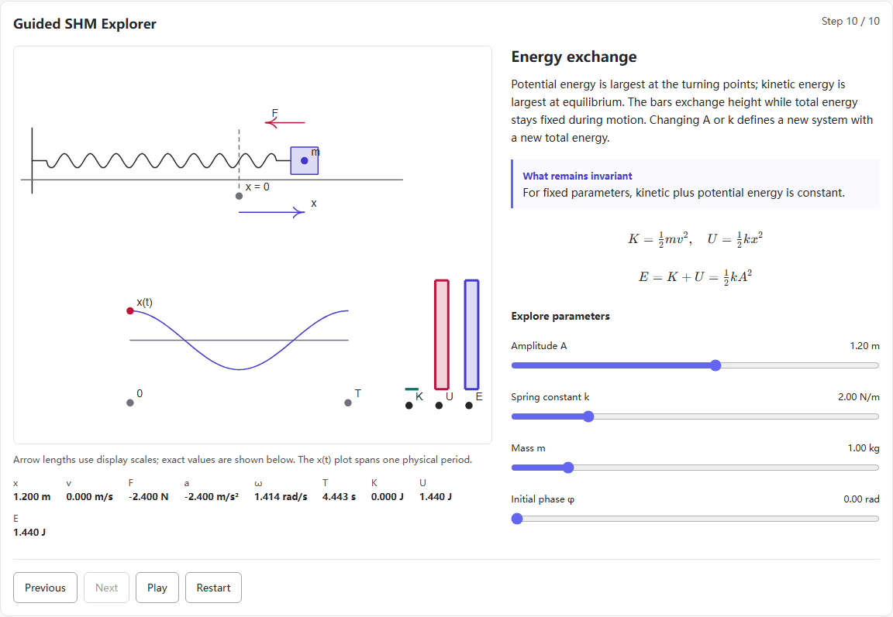
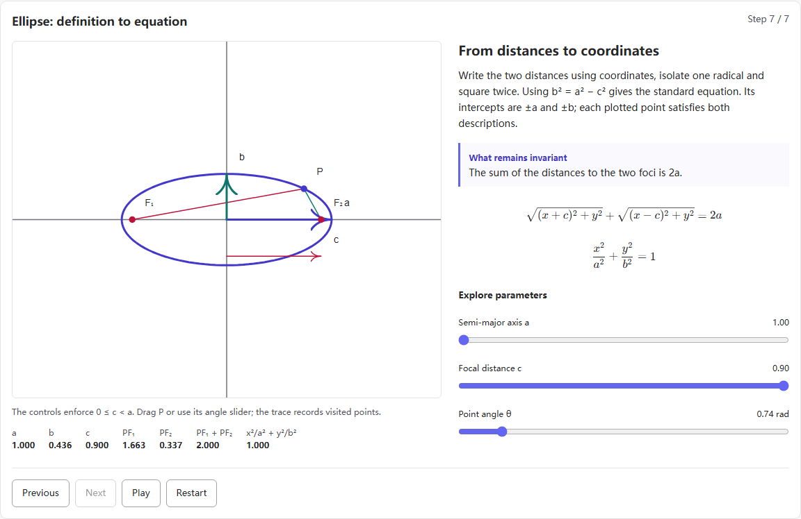
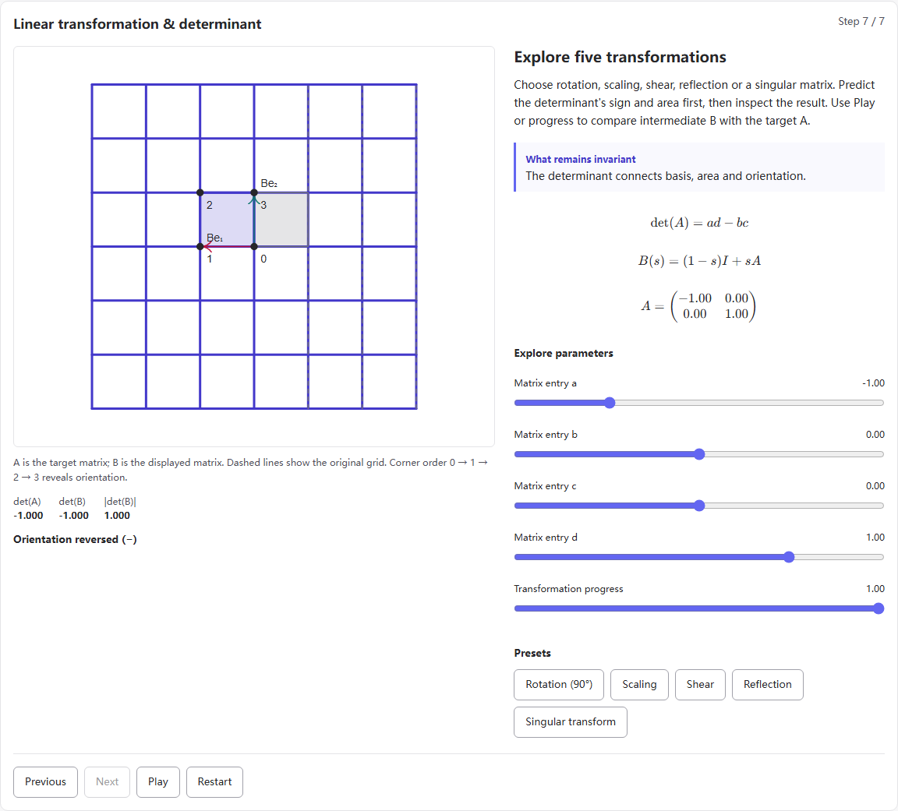
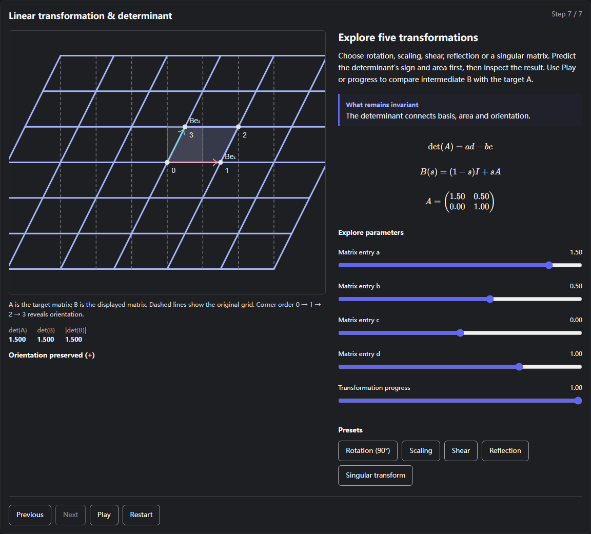

# Visual learning MVP validation

**Status: READY FOR REVIEW**

Version: **0.4.0-alpha.1**. Branch: `feat/concept-visual-learning-mvp`.
Validated implementation: `d18e81325b036ba724732e727d9af8ebf5fcd8d0` (subsequent documentation/screenshot commit only).
Validation date: **2026-10-05, Asia/Singapore**. Environment: Windows x64, Node 26.7.0, Rust/Cargo 1.98.1, real Chromium and Microsoft WebView2.

## Delivered product

Normal EN / zh-CN / zh-TW search resolves a canonical Concept ID. The resolved concept opens an overview with prerequisites, objectives, an ordered learning path, a native guided lesson, external search resources, textbook metadata and related/next concepts. There are **four supported profiles and three lessons**, not profiles for every ontology concept. Unsupported concepts retain their ordinary search/graph/resource experience with an explicit learning fallback.

```text
Ontology → Learning Registry → Visualization Registry
  → Guided State Machine → VisualizationRenderer → JSXGraphRenderer
```

The ontology remains semantic metadata. Teaching profiles and lesson definitions live separately. Numeric models and frames are independent of React and JSXGraph. Static reviewed definition data supplies every teaching state. The adapter owns SVG rendering, pointer input, resizing and disposal.

## Lessons

| Lesson | Steps | Interaction | Invariants and equations |
| --- | ---: | --- | --- |
| Simple harmonic motion | 10 | Previous/Next, Play/Pause, Restart, mass drag, A/k/m/φ sliders, motion view, x(t), energy bars | Force opposite displacement; `F=−kx`, `a=−ω²x`, `ω=√(k/m)`, `x=A cos(ωt+φ)`, `K+U=½kA²` for fixed parameters. The crossing state has F=0 with maximum speed. |
| Ellipse | 7 | Previous/Next, Play/Pause, Restart, constrained P drag, a/c/θ sliders, bounded visited-point trace | `PF₁+PF₂=2a`, `0≤c<a`, `b²=a²−c²`, `x²/a²+y²/b²=1`. Includes coincident foci (circle limit). |
| Linear transformation / determinant | 7 | Previous/Next, Play/Pause, Restart, matrix entries, progress, five presets | Columns equal transformed basis; actual transformed polygon area equals `|det(A)|`; sign indicates preserved/reversed orientation and zero collapses area. Intermediate B and target A are distinguished. |

All 24 states have complete EN / zh-CN / zh-TW explanations, invariants and named controls. A play action animates the current state without advancing the teaching step. Parameter changes pause; Restart restores the initial step and parameters. One-shot SHM release stops at the first crossing. Changing an ellipse's geometry clears its trace. Matrix interpolation is explicitly `B=(1−s)I+sA`.

## Textbook and terminology integration

Reviewed external paths:

- 物理（第二册）, 第一章: § 1.1 简谐振动; § 1.2 简谐振动方程; § 1.3 简谐振动方程中的参量; § 1.6 简谐振动的能量.
- 平面解析几何, 第四章 圆锥曲线: § 4·5 椭圆的定义; § 4·6 椭圆的标准方程; § 4·7 椭圆的性质.

Only source/book/chapter/section labels, concept IDs, language, URL and `external-reference` rights status are stored. The UI marks each link as an external textbook reference. No book prose, PDF, scan or illustration is copied or displayed. [The upstream rights statement](https://github.com/tradecatlabs/shulihuazixuecongshu#权利说明) remains authoritative; this project does not assign it a new license.

Four historical spellings map to modern spring-constant and phase IDs in a separate shared JSON file. The existing TS and Rust resolver lookups consume that file. Canonical labels and provider resource annotations remain modern. The misplaced 简谐振动 / 簡諧振動 synonyms were corrected from harmonic oscillator to simple harmonic motion; the translation test now checks both SHM and the unchanged 谐振子 label. No tests were deleted.

## Validation matrix

| Command | Latest result | Evidence |
| --- | --- | --- |
| `npm ci` | PASS | Clean locked install after stopping the development server. |
| `npm test` | PASS | 36 existing unit checks; 1,395 language resolutions; 51 golden cases; index baseline checks; 12 new learning-test groups. |
| `npm run build` | PASS | TypeScript + default/Tauri frontend bundle. |
| `npm run build:web` | PASS | TypeScript + Pages bundle. |
| `npm run test:web` | PASS | 23 existing browser groups plus all visual-learning regressions. |
| `npm run test:web:build` | PASS | Actual Pages subpath, provider indexes, workspace navigation and the same visual-learning suite; no Vite source-import shortcuts. |
| `npm run test:desktop` | PASS | Seven groups in the existing isolated audit profile on real WebView2, including native lesson controls and Tauri IPC. |
| `npm run benchmark` | PASS | Concept resolution/parity/recall gates all pass; zero false-positive regressions. |
| `npm run index:quality` | PASS | Counts, URL/annotation/coverage gates retained. Only three provider annotation files and their hashes changed. |
| `npm run ontology:validate` | PASS | 494 concepts, no dangling edges, duplicate IDs or invalid aliases. |
| `npm run ontology:audit` | PASS | Review suggestions generated; no automatic ontology expansion. |
| `npm run test:parity` | PASS | Exact TS/Rust golden groups, variants, match modes, ranking and explanations, including new concept/legacy cases. |
| `cargo fmt --manifest-path src-tauri/Cargo.toml --check` | PASS | Rust formatting. |
| `cargo test --manifest-path src-tauri/Cargo.toml --no-default-features` | PASS | 38 core tests. |
| `cargo clippy --manifest-path src-tauri/Cargo.toml --no-default-features --all-targets -- -D warnings` | PASS | All core targets. |
| `cargo check --manifest-path src-tauri/Cargo.toml --locked` | PASS | Tauri desktop compilation. |
| `cargo test --manifest-path src-tauri/Cargo.toml` | PASS | 38 tests with full features. |
| `cargo clippy --manifest-path src-tauri/Cargo.toml --all-targets -- -D warnings` | PASS | Full-feature targets. |
| `npm audit --omit=dev` | PASS | No production dependency findings at validation time. |

No required command was skipped. An early clean-install attempt hit a Windows lock on the active Vite native module; it was resolved by stopping that server and reinstalling. Cold desktop runs also encountered the unchanged eight-second Math Insight refresh timeout. Strict reruns passed with the provider-error assertions and deadlines retained. External viewer and translation pages use the suite's existing fixtures; native provider search still uses the real Rust provider/cache boundary.

### Pull request checks

The first remote run passed frontend compilation, Windows desktop compilation, Rust core tests/clippy, retrieval parity and all CodeQL analyses. CodeForge's new-finding gate flagged nine intentional test-runner progress messages as production `console.log` diagnostics. The affected scripts now explicitly write their CLI progress to `process.stdout`, preserving every assertion and message. The baseline and gate were not weakened. Unit and both browser suites were rerun after that adjustment. [PR #19 checks](https://github.com/styayur/stem-visual-explorer/pull/19/checks) track the latest commit's remote validation.

### What the new checks prove

- Profiles, path/step IDs, concept IDs, presets and localized fields are complete and linked. Every authored equation parses in KaTeX.
- SHM force/acceleration directions, angular frequency, crossing velocity and conservation are checked over amplitude/mass/stiffness/phase combinations.
- Ellipse focal sums, equation, b² relation, circle limit and normalized c<a constraint are checked numerically.
- Matrix tests use actual transformed polygon signed area, basis images and all five presets, including the singular case and intermediate collapse.
- Pure reducer tests cover pause/resume/reset, bounded frame time, disabled reduced-motion playback, one-shot completion and trace clearing.
- Real browser tests exercise pointer dragging, keyboard sliders, every lesson state in all three languages, navigation, pause/play/reset, references and unsupported concepts.
- A 390px viewport verifies no horizontal overflow **and that the physical mass remains inside the resized diagram**. The adapter's ResizeObserver re-applies the authored scene bounds.
- Search and unopened overview make no lesson-engine asset requests. Actual lessons run with global eval and Function blocked; only identified Playwright UtilityScript attempts occur. No application dynamic execution or remote script requests occur.
- Dark-mode JSXGraph and selectable KaTeX/MathML were also inspected in native Python Playwright, without uncaught errors.

## Bundle impact

Vite's reported bundle sizes (decimal kB):

| Asset | Before | After | When loaded |
| --- | ---: | ---: | --- |
| Search JS (default build) | 374.66 / 97.31 gzip | 391.74 / 103.89 gzip | Initial app. About +17.08kB raw / +6.58kB gzip for overview, metadata and integration. |
| Search JS (Pages) | — | 391.78 / 103.94 gzip | Initial Pages app. |
| Guided engine JS | — | 862.38 / 247.62 gzip | Only after a lesson/path state is opened. |
| Guided + KaTeX CSS | — | 32.56 / 8.85 gzip (default); 33.80 / 8.88 gzip (Pages) | Lazy lesson stylesheet. |

KaTeX fonts are local assets requested from the lazy stylesheet as needed. Ordinary search does not load JSXGraph, KaTeX or the full lesson definitions. The lessons share one engine chunk, so Vite correctly reports its >500kB warning. The numeric-only JSXGraph entry omits the default executable parser and the unrelated 3D registrations; the source-version probe guard fails if the pinned dependency changes unexpectedly.

## Main files

- `src/learning/`: typed profile registry, structured textbook metadata, shared historical spellings, localized UI text, concept learning surface.
- `src/visualizations/`: reviewed lesson definitions, pure mathematical models, scenes, reducer, common lesson UI and equation rendering.
- `src/visualizations/renderers/`: adapter contract, numeric-only JSXGraph entry, disabled expression parser and SVG lifecycle/resize handling.
- `src/components/SearchContext.tsx`, `src/pages/SearchPage.tsx`, `src/lib/shortcuts.ts`: existing search integration and focus/shortcut behavior.
- `scripts/learning_test.mjs`, `scripts/visual_learning_regression.mjs`, existing browser/desktop suites and golden fixtures: mathematical and product regressions.
- `vite.config.ts`: dependency boundary; package/Cargo/Tauri versions: `0.4.0-alpha.1`.
- `docs/visual-learning.md`, both READMEs and screenshots below: usage, architecture, rights and extension instructions.

## Screenshots









[390px mobile lesson](../assets/visual-learning/mobile.png)

## Remaining limitations

- Four learning profiles and three 2D lessons; other concepts deliberately use the graceful fallback. No complete course/LMS or 3D renderer is included.
- The SHM model is ideal and undamped. Before release, displacement dragging stays on the positive side; the opposite-side teaching state demonstrates compression. Force/velocity arrows use disclosed display scales.
- Ellipse sliders retain a 0.1 gap between c and a to avoid the degenerate case; the trace is capped at 600 samples. Textbook metadata remains in the source language, while native lesson/UI text is fully localized.
- Linear matrix interpolation is a preview path, not a fractional rotation model; intermediate singular matrices are possible and explicitly explained.
- The first lesson download is sizeable and has no new offline/PWA installation guarantee. Further splitting is appropriate when more lesson families are added.
- Cold native-provider verification depends on upstream availability and can hit the existing timeout. No provider timeout or assertion was weakened.
- `npm ci` reports five existing high-severity **development-tool** findings through Tailwind 3's glob/watch dependency chain. Production audit is clean. A Tailwind major migration is outside this feature PR.

No GitHub Release was published and no PR was merged.
