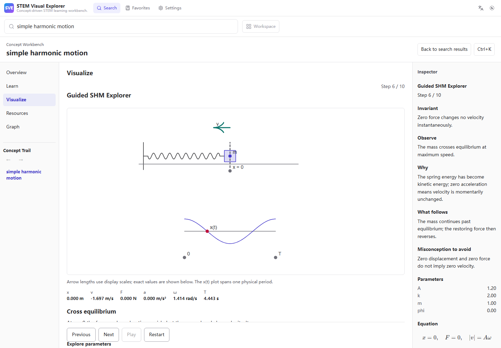
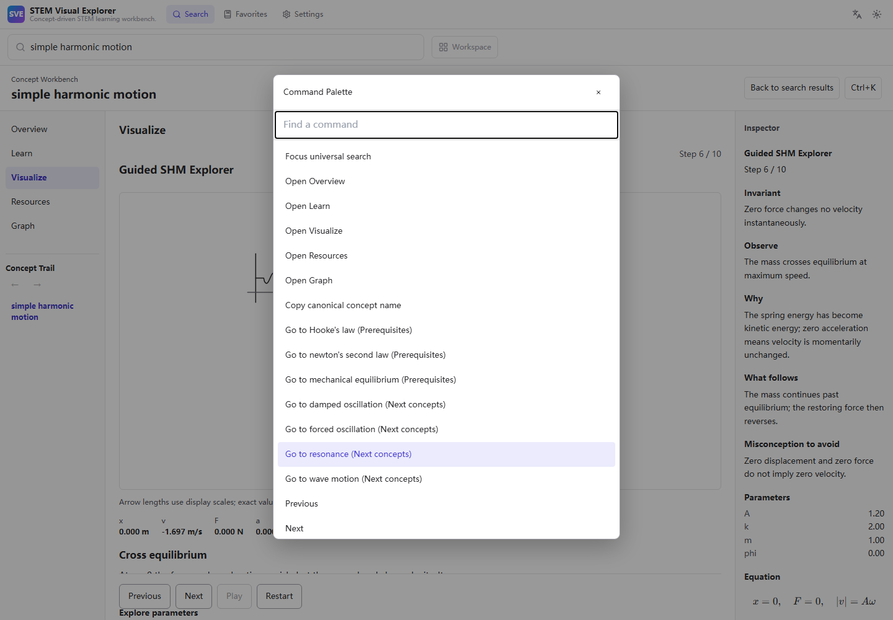
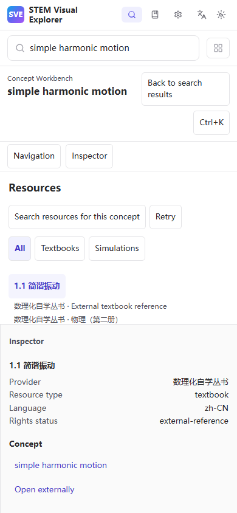

# v0.4.0-alpha.2 Workbench validation

Local validation: Windows, Node 26.7.0, real Tauri/WebView2, 2026-10-05.
This branch is stacked on the unmerged visual-learning MVP, PR #19, at
`d5f946d68968156112501f34bfaca3999ddb5cd4`. It neither merges that PR nor
publishes a release. CI uses Node 22 independently.

## Product and architecture

Search discovers a canonical concept. A separate ConceptSession now owns its
surfaces, capability selection and bounded back/forward trail. Search history
stays in the search store. Related, prerequisite, path, graph and resource
annotations all enter the same concept workflow. Ordinary resource search is
an explicit action.

```text
Query / Graph / Resource / Learning Path
                    ↓
              ConceptSession
                    ↓
             Concept Workbench
                    ↓
             Capability Registry
    Learn / Visualize / Read / Explore / Practice
```

The five surfaces share a contextual Inspector and keyboard command palette.
Universal search projects concepts, lessons, visualizations, textbooks,
matching-response resources and graph actions through existing resolution.
Empty capability groups and unavailable surfaces disappear. The three existing
lessons retain all 24 states, trilingual descriptions and mathematical models.
Optional misconception/observation/cause/consequence fields add authored context.

| Previous problem | Result |
| --- | --- |
| Last search response supplied another concept's resources | Direct indexed `concept_ids` membership supplies the active concept. SHM → resonance checks exact resource IDs. |
| Concept links sometimes started textual searches | Canonical navigation updates ConceptSession; normal search is separate. |
| Long learning page | Task-focused surfaces with navigation, independently scrolling center and contextual Inspector. |
| All lesson definitions shipped together | Three explicit lazy lesson imports; opening SHM downloads no sibling definitions. |
| Separate resource/lesson/textbook models | Typed read adapters unify capabilities and preserve source ownership/provenance. |

See [workbench architecture](../workbench-architecture.md) and
[visual learning](../visual-learning.md) for extension and migration details.
The original panel is replaced; its test landmark remains compatible.

## Adversarial Query Robustness Benchmark

The original canonical benchmark/parity suite is unchanged. A separate dataset
contains **220** unique reviewed queries in 11 classes, with independently
authored gold expectations in a separate file. Expected Concept IDs are
validated against the ontology. No aliases were added to improve these scores.

| Metric | Result | Definition |
| --- | --- | --- |
| Exact concept resolution | **93/220 = 42.27%** | Returned Concept ID set equals the gold set, including expected none. |
| Top concept accuracy | **76/192 = 39.58%** | First returned ID matches any expected ID, positive cases only. Existing resolver returns sorted IDs; this is not a semantic ranking metric. |
| Negative precision | **19/28 = 67.86%** | Correct empty resolutions divided by gold-negative cases, including eight ambiguous expected-none cases. This requested label denotes negative-case rejection accuracy, not conventional positive predictive precision. |

| Class | Exact matches | Rate |
| --- | --- | --- |
| Colloquial Chinese | 0/20 | **0%** |
| Script variants | 6/20 | 30% |
| English abbreviations | 14/20 | 70% |
| Typos | 0/20 | **0%** |
| Mixed language | 18/20 | 90% |
| Symbolic notation | 0/20 | **0%** |
| Formula-like queries | 3/20 | 15% |
| Ambiguous short terms | 20/20 | 100% |
| Multi-concept queries | 13/20 | 65% |
| Negative class | 11/20 | 55% |
| Historical terminology | 8/20 | 40% |

| Language | Exact matches | Rate |
| --- | --- | --- |
| zh-CN | 16/58 | 27.59% |
| zh-TW | 6/18 | 33.33% |
| English | 53/104 | 50.96% |
| Mixed | 18/20 | 90% |
| Symbolic | 0/20 | 0% |

These results expose lexical weaknesses, especially colloquial descriptions,
typos, notation and formulas. They do **not** establish general semantic
understanding. Benchmark PASS means a valid dataset was measured, not a
robustness score gate. The tracked summary is
[`artifacts/adversarial-query-summary.json`](../../artifacts/adversarial-query-summary.json);
the command regenerates detailed failures and the summary, and CI retains both.

The canonical suite still passes: 1,395 canonical-name queries, 100% concept
resolution/parity, zero protected false-positive regressions. Its sparse
snapshot coverage remains visible: 687/1,395 queries return no resources.

## Production performance

Vite-reported decimal kB, JavaScript gzip; alpha.1 baseline compared with this
branch. These are transfer sizes, not measured startup timings.

| Asset | alpha.1 | alpha.2 |
| --- | ---: | ---: |
| Initial JS, default build | 103.89 | 104.47 (+0.58, ~0.56%) |
| Initial JS, Pages build | 103.94 | 104.49 (+0.55, ~0.53%) |
| Workbench shell, lazy | — | 3.58 |
| Command Palette, lazy | — | 1.55 |
| Shared visualization player / JSXGraph | 247.62, combined definitions/KaTeX | 160.17 |
| KaTeX / Equation, lazy | Included above | 77.70 |
| SHM definition | Included above | 3.85 |
| Ellipse definition | Included above | 3.03 |
| Linear/determinant definition | Included above | 3.31 |

Additional shared chunks are 2.94 kB (`jsx-runtime`), 0.21 kB helpers and 0.29 kB
graph. CSS remains separate: shell 1.68 kB gzip, palette 0.51, player 0.95,
Equation approximately 7.97 (default) / 8.01 (Pages). The shared player remains
large and Vite reports its normal >500 kB raw warning. Removing runtime parsers
and splitting definitions avoids accumulating all future lessons in that chunk.
Network and manifest assertions prove Overview and Resources do not load
JSXGraph/KaTeX, and SHM does not load ellipse/linear definitions.

## Local command results

| Command | Status | Evidence |
| --- | --- | --- |
| `npm ci` | PASS | Clean lockfile installation. |
| `npm test` | PASS | Existing search/retrieval/golden/learning checks plus session, trail, resources, capabilities, curriculum, commands and lazy/security unit coverage. |
| `npm run build` | PASS | TypeScript and production default build. |
| `npm run build:web` | PASS | TypeScript and production Pages build. |
| `npm run test:web` | PASS | 23 preserved browser groups plus lesson and workbench workflows. |
| `npm run test:web:build` | PASS | Actual `/stem-visual-explorer/` Pages subpath, lessons, workbench and final-bundle AST/provenance. |
| `npm run test:desktop` | PASS | All seven real WebView2 groups, including native workbench and external-link IPC. |
| `npm run benchmark` | PASS | Existing canonical gates unchanged. |
| `npm run benchmark:adversarial` | PASS | 220 valid cases measured; weak scores above. |
| `npm run index:quality` | PASS | Existing provider/index baseline quality. |
| `npm run ontology:validate` | PASS | 494 canonical concepts. |
| `npm run ontology:audit` | PASS | Existing ontology statistics and relation audit. |
| `npm run test:parity` | PASS | Shared TS/Rust contract. |
| `npm run test:visual-bundle` | PASS | AST of 11 emitted JS assets, isolated lesson entries, zero original parser modules and pinned numeric boundary. |
| `npm audit --omit=dev` | PASS | Zero production vulnerabilities. |
| `cargo fmt --manifest-path src-tauri/Cargo.toml --check` | PASS | Formatting. |
| `cargo test --manifest-path src-tauri/Cargo.toml --no-default-features` | PASS | 38 Rust tests. |
| `cargo clippy --manifest-path src-tauri/Cargo.toml --no-default-features --all-targets -- -D warnings` | PASS | Pure core lint. |
| `cargo check --manifest-path src-tauri/Cargo.toml --locked` | PASS | Full Windows/Tauri compile. |
| `cargo test --manifest-path src-tauri/Cargo.toml` | PASS | Full-feature environment, 38 tests. |
| `cargo clippy --manifest-path src-tauri/Cargo.toml --all-targets -- -D warnings` | PASS | Full-feature lint. |

No required command is skipped. Real desktop regression uses an isolated
audit identifier/profile and refuses normal user profiles. One repeat encountered
a live Physics Fundamentals index-refresh timeout; the entire unmodified gate
passed on retry. An earlier external-link test tried to instrument immutable
Tauri IPC; it now verifies the actual native response and safe request URL.

Python Playwright visual QA additionally inspected real desktop, command palette
and 390px mobile screenshots; page errors and horizontal overflow checks passed.
Keyboard regression covers focus restoration, palette containment, concept
trail, lesson controls and reduced motion. Final asset validation and browser
interaction keep global eval/Function blocked. No CSP or iframe expansion occurs.

## Limitations

- Three reviewed lessons only; no generated or additional shallow lessons.
- Direct snapshot annotations do not infer resources through related concepts;
  native refresh remains the separate ordinary search path. Empty states and
  partial-provider failures are explicit.
- Universal search is deterministic and bounded. It does not fix the lexical
  weaknesses above or add a fuzzy launcher or semantic ranker.
- Graph is a bounded local relation projection, not a global force graph.
- External curriculum is metadata only. Unknown license stays unknown; no
  external scans, illustrations or full text were imported.
- Session persistence is local to the window and requires explicit Resume.
  No cloud account, telemetry or resource-payload persistence is added.
- The lazy numeric player still has a substantial first-use download.
- Existing development-only Tailwind toolchain audit warnings remain; no
  dependency upgrade is mixed into this architecture change.

## Screenshots







GitHub's default CodeQL setup covers PRs targeting default/protected branches,
so it does not trigger on this unprotected stacked target. A separate
`Stacked PR CodeQL` workflow analyzes exact HEAD for Actions, JavaScript/TypeScript,
Python and Rust. It retains SARIF without uploading into the existing default
setup and rejects missing evidence or any findings, without suppressions.
See [setup triggers](https://docs.github.com/en/code-security/concepts/code-scanning/setup-types)
and [CodeQL analyze output/upload options](https://github.com/github/codeql-action/blob/main/analyze/action.yml).
Remote check results and immutable final HEAD are recorded in the PR and final
delivery after all configured runs settle.
